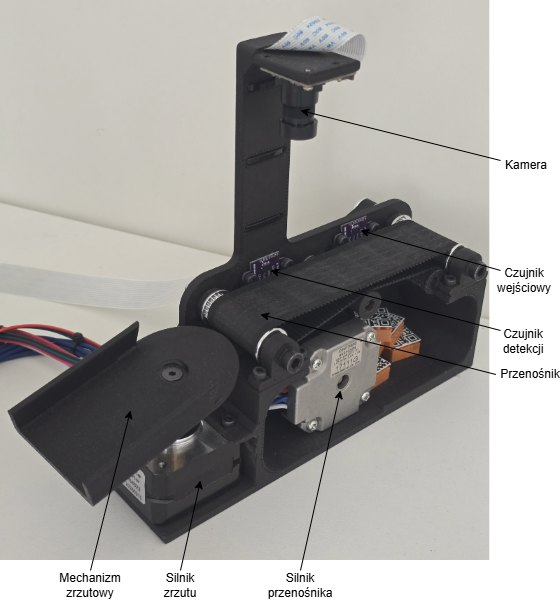
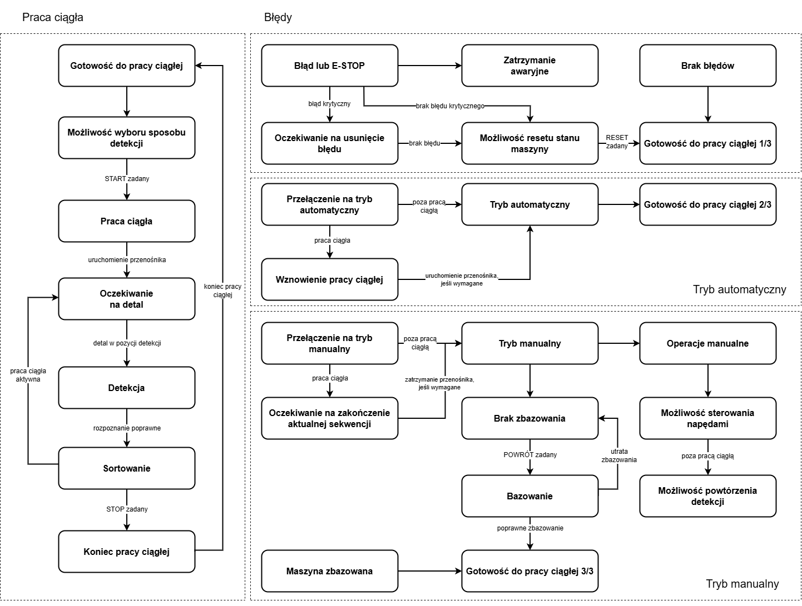
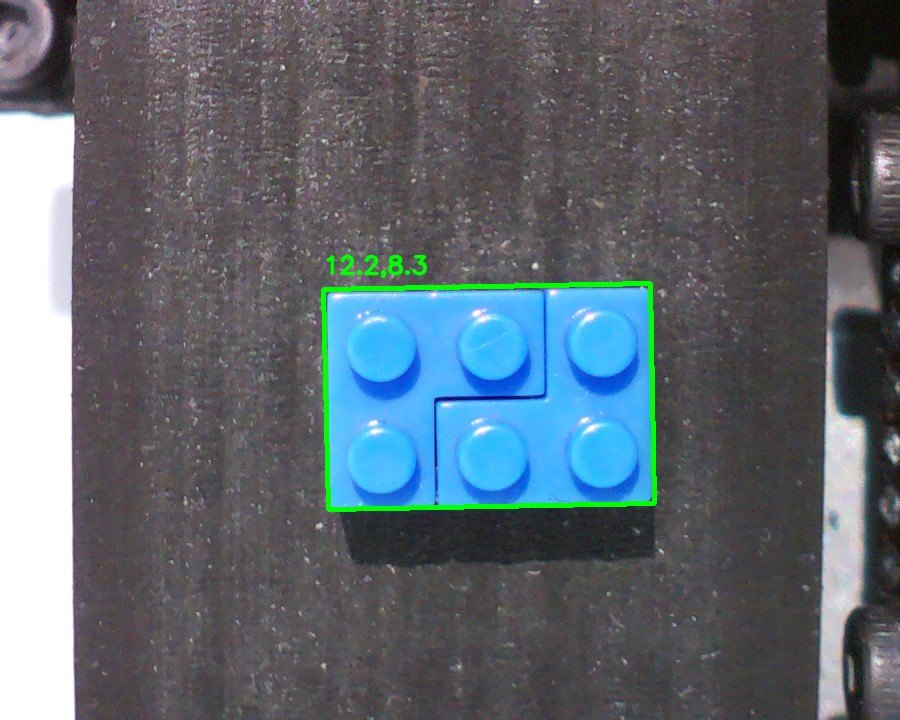
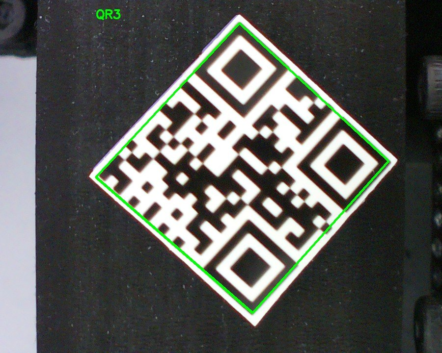
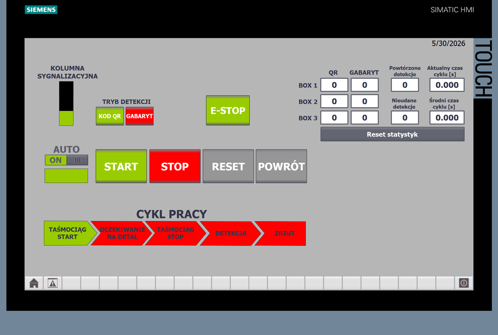
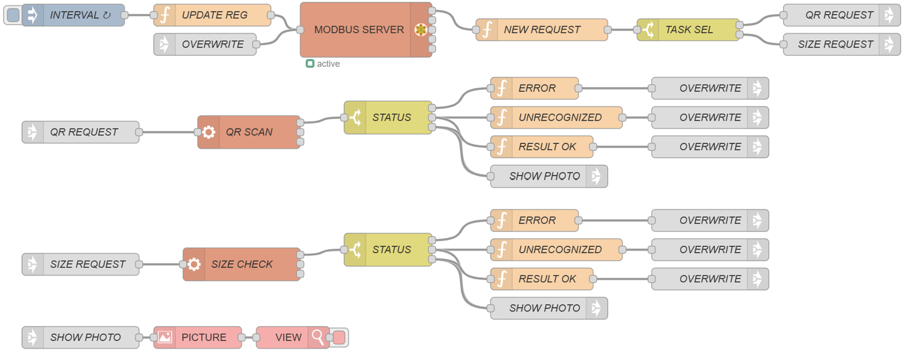

# Industrial Sorting Machine Prototype

PLC-based sorting station built for my master's thesis. The project combines a virtual Siemens PLC/HMI with ESP32, STM32 and Raspberry Pi modules connected over wired Modbus TCP.



## What the machine does

The station moves one workpiece at a time on a short conveyor. The PLC stops the workpiece under the camera, requests QR or size recognition, selects the target bin and runs the diverter sequence. The logic also includes manual mode, emergency stop priority, communication timeouts and HMI diagnostics.

## System overview


| Area | Implementation |
| --- | --- |
| Main controller | Siemens PLC logic in TIA Portal, tested with PLCSIM Advanced |
| HMI | Operator screens for auto/manual mode, alarms, counters and diagnostics |
| Sensor module | ESP32, W5500 Ethernet module and two VL53L0X distance sensors |
| Drive module | STM32F411, W5500 Ethernet module, two stepper drivers, conveyor and diverter motors |
| Vision module | Raspberry Pi, camera, Node-RED flow and local OpenCV/Flask service |
| Communication | Wired Ethernet, Modbus TCP, cyclic reads and task-based commands |

## Test results



The prototype was checked with communication timing, positioning and recognition tests. The measured spread of the stopped workpiece position was 4.3 mm. The estimated limit from communication delay and braking was 5.87 mm. The timeout threshold was also tested for about 30 minutes without false timeout events.


## Vision examples

| QR recognition | Size recognition |
| --- | --- |
|  |  |
|  |  |

## HMI and Node-RED

| HMI auto mode | Node-RED communication flow |
| --- | --- |
|  |  |

## Repository structure

```text
.
|-- assets/                    # exported figures and prototype photos
|-- docs/                      # short technical notes
|-- firmware/
|   |-- esp32-sensor-module/    # ESP32 + VL53L0X + W5500 Modbus TCP server
|   `-- stm32-drive-module/     # STM32 stepper control and Modbus TCP task handler
`-- software/
    `-- vision-module/          # Raspberry Pi OpenCV/Flask recognition service
```

Docs:

- [Architecture](docs/architecture.md)
- [Communication model](docs/communication.md)
- [Testing summary](docs/testing.md)
- [Thesis summary](docs/thesis-summary.md)

## Repository note

This is the readable project version for GitHub: application code, selected figures and short technical notes. Build output, the full thesis source tree and temporary IDE files are not included.
