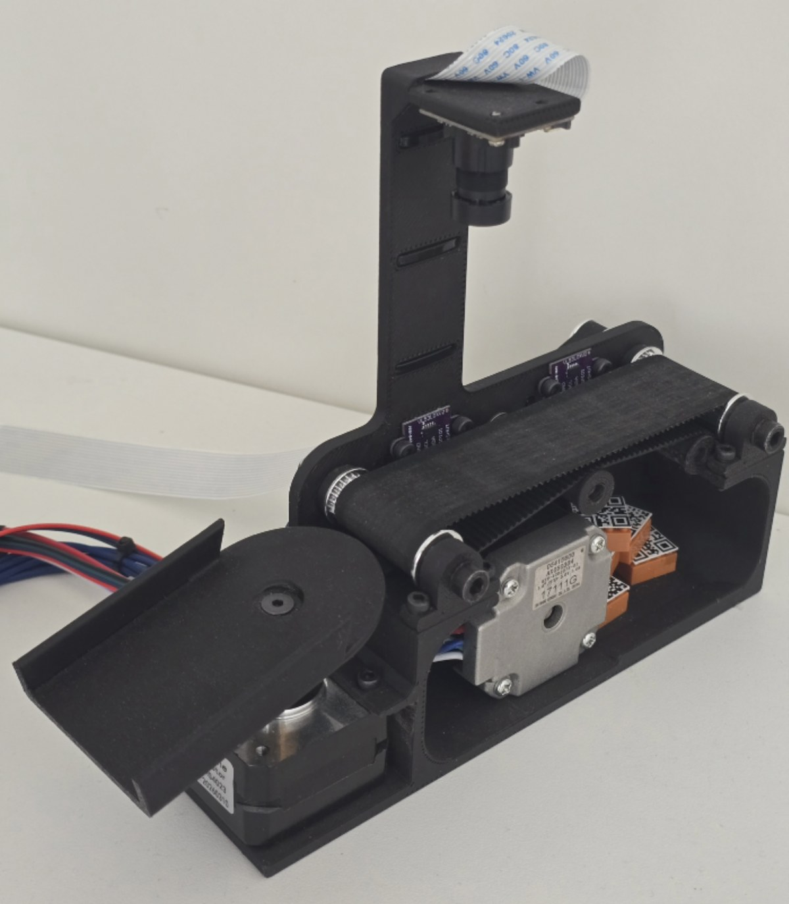

# Engineering Portfolio

Selected engineering projects from my studies and thesis work. The repository is organized as a small portfolio, so each project has its own README, selected code, figures and short technical notes.

## Projects

| Project | Preview | Main topics |
| --- | --- | --- |
| [Industrial Sorting Machine Prototype](projects/industrial-sorting-machine-prototype/) |  | PLC control, PLCSIM Advanced, HMI, Modbus TCP, ESP32, STM32, Raspberry Pi vision, OpenCV |
| [Military Mobile Robot for Mine Detection](projects/military-mobile-robot-mine-detection/) |  | ESP32 web control, camera stream, TMC2209 stepper control, pulse-induction metal detector, 3D-printed chassis |

## Repository note

The repository contains selected, readable project files prepared for portfolio review. Temporary IDE files, generated build output, old experimental folders and full thesis source trees are not included.
