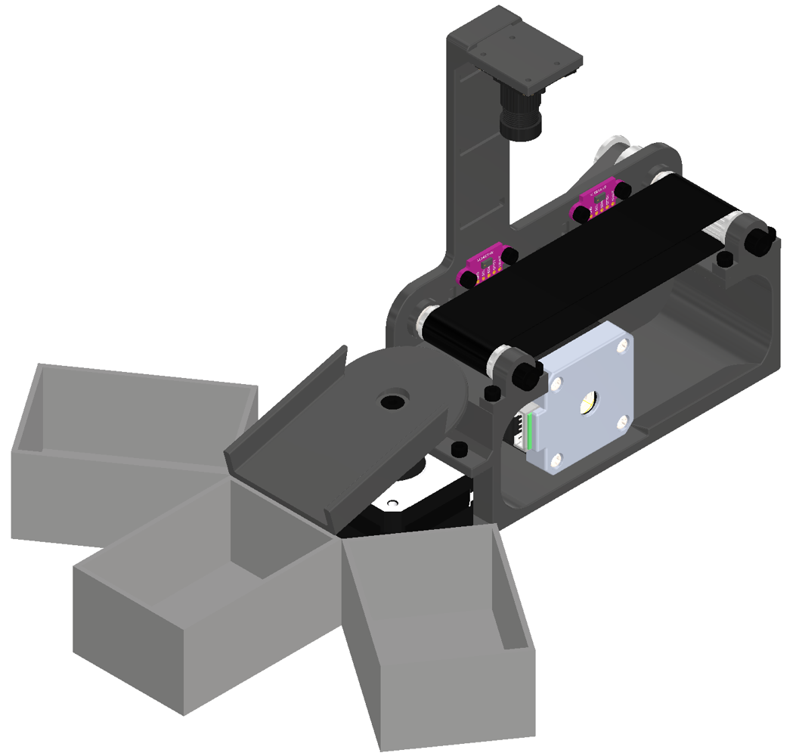
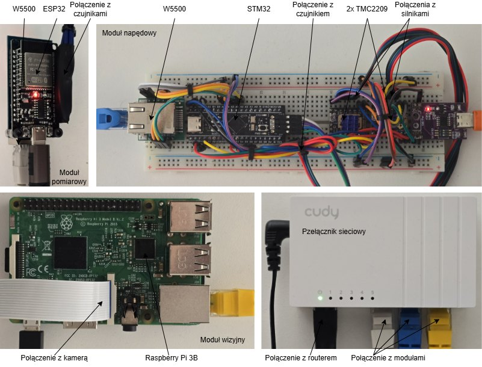

# Architecture

## Mechanical layout

The station uses a short conveyor and a three-position diverter. The CAD model defined the camera position, detection area and receiving bin locations before the mechanical parts were printed.

The prototype electronics are mounted as separate boards, not in a final control cabinet. Each module has local electronics and communicates with the PLC over wired Ethernet.

## Module list

| Module | Main role | Hardware |
| --- | --- | --- |
| PLC | sequence control, modes, alarms, task dispatching | PLCSIM Advanced during development |
| ESP32 sensor module | workpiece presence and sensor error flags | ESP32, W5500, 2x VL53L0X |
| STM32 drive module | conveyor motion, diverter motion and homing state | STM32F411, W5500, 2x stepper drivers, Hall sensor |
| Raspberry Pi vision module | QR and size recognition | Raspberry Pi, camera, OpenCV, Node-RED |

## Control concept

The PLC is the main decision point. Embedded modules handle local hardware tasks and return compact results through Modbus registers. Motor pulse generation stays on the STM32 timer, while the machine sequence stays in the PLC program.
