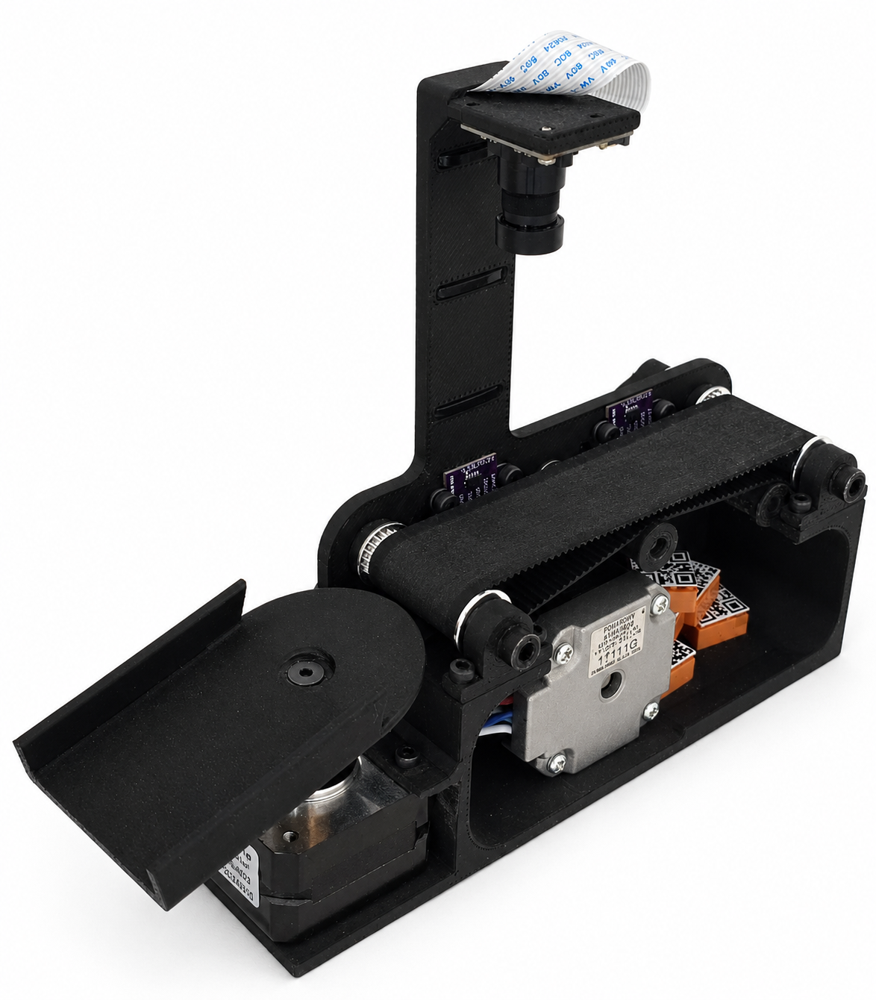
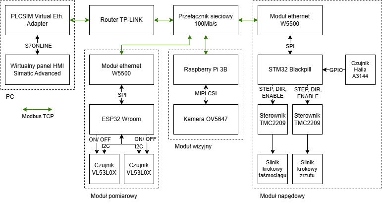
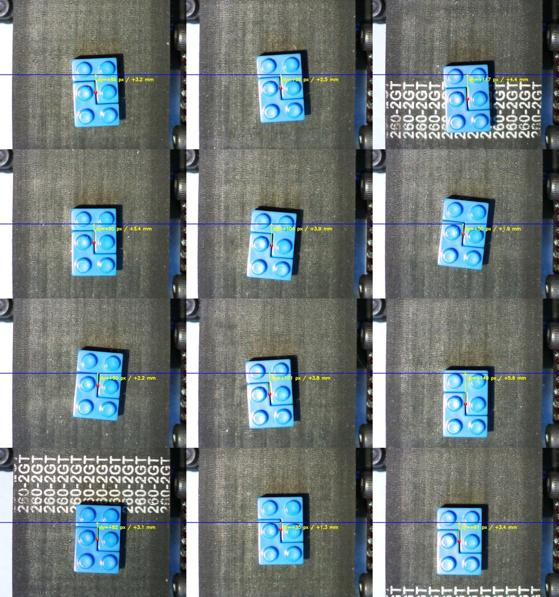
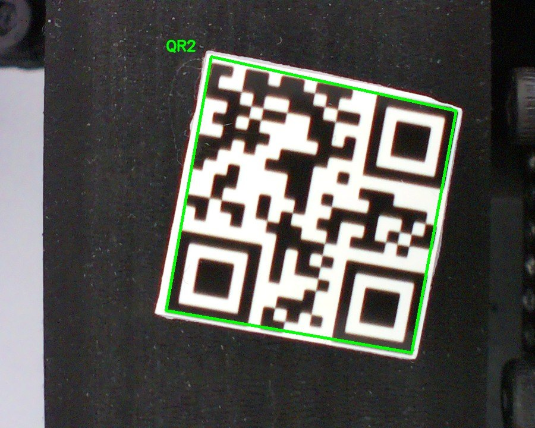
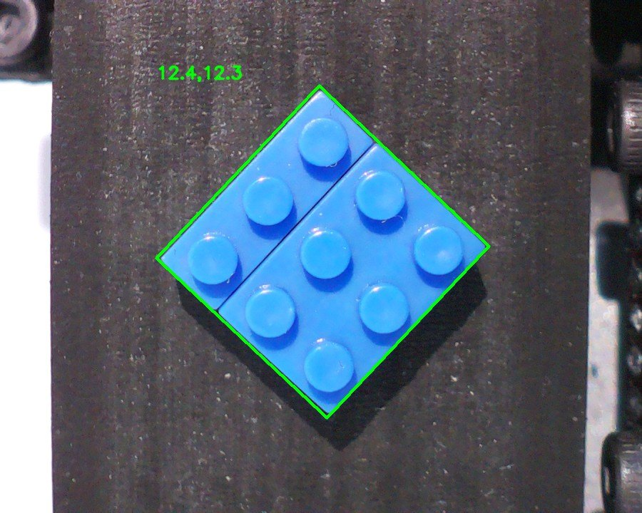

# Industrial Sorting Machine Prototype

PLC-based sorting station built for my master's thesis. The project combines a virtual Siemens PLC/HMI with three embedded modules: ESP32 for workpiece presence sensing, STM32 for stepper motor control and Raspberry Pi for vision recognition. All modules communicate with the PLC over wired Modbus TCP.

  

## Project goal

The main goal was to build a working prototype of a small industrial sorting machine and check whether a distributed control structure can work reliably in a repeatable sorting cycle. The PLC is responsible for the machine sequence, mode handling and error handling. The embedded modules handle local hardware tasks that are easier or more deterministic to run close to the device.

The prototype is not a final industrial machine. It is a functional model used to test the control concept, wired communication, workpiece recognition and reaction to selected fault cases.

## How the machine works

The station handles one workpiece at a time. A conveyor moves the workpiece from the entry position to the camera area. After the detection sensor confirms the correct position, the PLC stops the conveyor and requests recognition from the vision module. Depending on the selected mode, the workpiece is classified by QR code or by size.

After recognition, the PLC selects the receiving bin and sends a motion task to the STM32 drive module. The drive module moves the diverter to the target position, runs the conveyor long enough to drop the workpiece and then returns the diverter to the home position. The next cycle can start after the machine returns to a ready state.

## System overview

  

| Area | Implementation |
| --- | --- |
| Main controller | Siemens PLC logic in TIA Portal, tested with PLCSIM Advanced |
| HMI | Operator screens for auto/manual mode, alarms, counters and diagnostics |
| Sensor module | ESP32, W5500 Ethernet module and two VL53L0X distance sensors |
| Drive module | STM32F411, W5500 Ethernet module, two stepper drivers, conveyor and diverter motors |
| Vision module | Raspberry Pi, camera, Node-RED and local OpenCV/Flask service |
| Communication | Wired Ethernet, Modbus TCP, cyclic reads and task-based commands |

## Why this architecture

The PLC keeps the main machine logic in one place: automatic cycle, manual mode, alarm handling and task supervision. The ESP32 and STM32 are used as remote modules because they can handle local I/O and timing close to the hardware. The STM32 generates step pulses with hardware timers, so motor timing does not depend on the PLC scan time or Ethernet communication jitter.

The Raspberry Pi vision module is separated from the PLC because image processing is easier to implement and debug in Python/OpenCV. Node-RED connects the local recognition service with Modbus registers used by the PLC.

## Communication concept

The PLC acts as a Modbus TCP client. The ESP32, STM32 and Raspberry Pi side act as Modbus servers. Two types of data exchange are used:

- cyclic reads for current states, such as sensor detection, motion state and homing state,
- task commands, where the PLC writes a task number and confirmation number, then waits for a matching response.

The confirmation number is used to avoid accepting an old response as a result of a new task. This is especially important when the machine is stopped, reset or switched between automatic and manual operation.

## Selected tests
The prototype was checked with communication timing, positioning and recognition tests. The measured spread of the stopped workpiece position was 4.3 mm. The estimated limit from communication delay and braking was 5.87 mm. The timeout threshold was also tested for about 30 minutes without false timeout events.

  

## Vision examples

| QR recognition | Size recognition |
| --- | --- |
|  |  |
|  |  |

## HMI

The operator panel was prepared for automatic and manual operation. It shows the current machine state, selected recognition mode, cycle counters and alarm information. Manual controls were useful during testing because individual actions could be checked without running the full automatic sequence.

  

## Repository note

This is the readable project version for GitHub: application code, selected figures and short technical notes. Build output, the full thesis source tree and temporary IDE files are not included.
