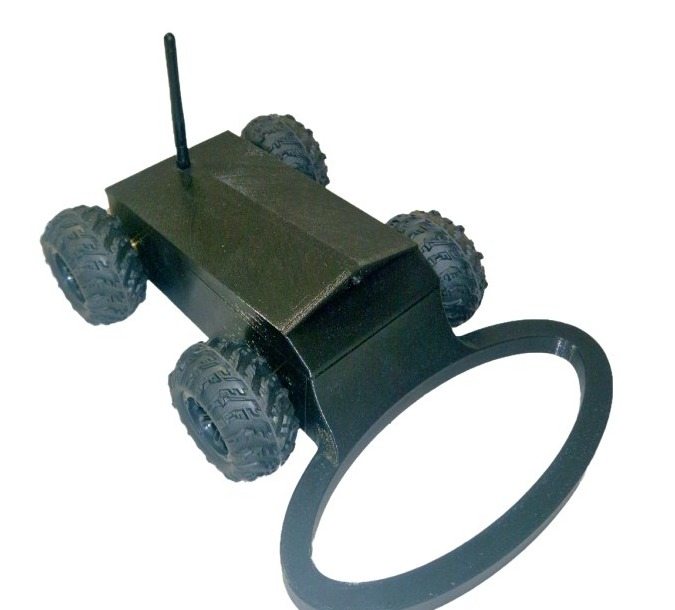
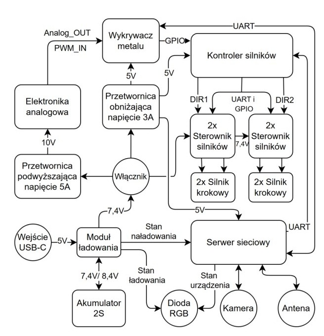
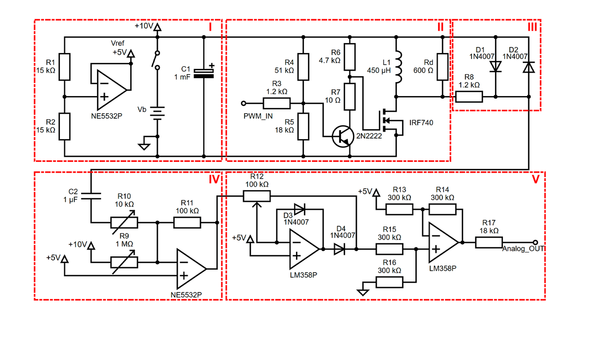
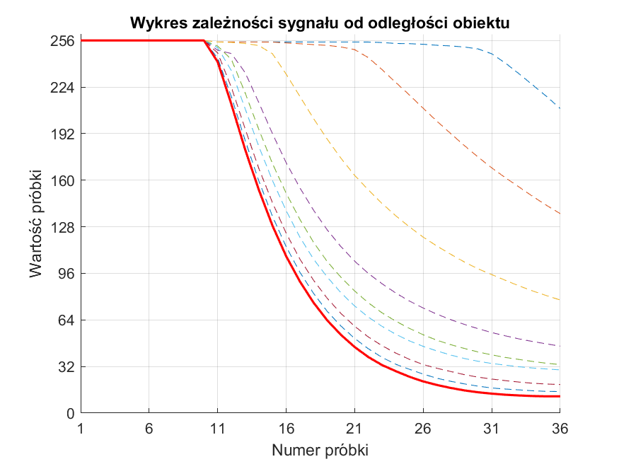
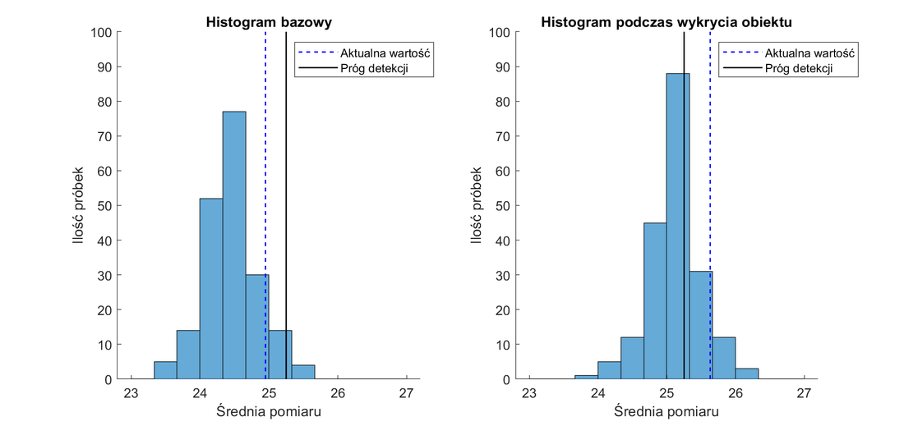
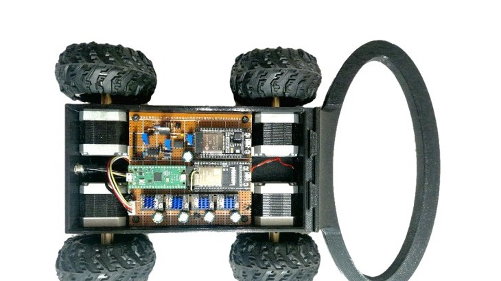

# Military Mobile Robot for Mine Detection

Mobile robot prototype built for my engineering thesis. The goal was to design and build a remotely operated platform that can detect metal objects comparable to anti-personnel mine components, while sending live camera feedback to the operator.

  

## Project goal

The project covered the full mechatronic design of the robot: mechanical structure, electronic modules, motor control, pulse-induction metal detector, wireless operator interface and test measurements. The final model was built around ESP32 modules, stepper motors, a custom detector circuit and 3D-printed mechanical parts.

This repository contains the readable portfolio version of the project. It includes selected firmware, exported figures and lightweight mechanical files. Full Inventor folders, old test sketches, thesis drafts and large reference PDFs are intentionally not included.

## System overview

  

| Area | Implementation |
| --- | --- |
| Operator interface | ESP32 WROVER web server with camera stream and control buttons |
| Motor controller | ESP32 WROOM, UART command interface and TMC2209 stepper drivers |
| Detection module | Pulse-induction detector with analog signal conditioning and ADC sampling |
| Motion system | Four stepper motors, configurable speed/current profiles and stop on detection |
| Mechanical design | 3D-printed chassis, coil holder and top cover with camera/antenna mounting |
| Power supply | 2S battery pack, charging module and voltage converters for logic and detector stages |

## How it works

The operator connects to the ESP32 WROVER web interface. The interface shows the camera stream and provides buttons for direction, speed profile, detector sensitivity and device status. The WROVER module sends commands over UART to the motor controller and receives detector data used by the web page.

The ESP32 WROOM motor controller drives the stepper motors through TMC2209 drivers. Motion profiles can be changed from the operator panel. When the detector module reports a valid metal object, the robot can stop automatically instead of driving over the detected area.

## Metal detector

The detector is based on a pulse-induction concept. A coil is excited with a short pulse, then the decay response is sampled and compared with a reference level. A metal object changes the measured response, so the firmware can detect it by comparing averaged samples with the configured threshold.

  

During testing, the detector response was checked for different object distances and sensitivity settings. The measurement plots were used to choose thresholds that gave stable detection without triggering on normal signal noise.

| Detector response | Signal distribution |
| --- | --- |
|  |  |

## Mechanical model

The mechanical part was designed as a compact printed structure. The platform holds the electronics and drive components, the front section supports the detector coil, and the top cover provides space for the camera and antenna. STEP files are included for the main printed parts.

  

## Notes

The code is kept close to the thesis version, with credentials removed and one copied typo corrected in the motor-controller sketch. The project is not a production-ready demining device. It is a student prototype used to verify the mechanical layout, wireless control, motor control and metal detection concept.
