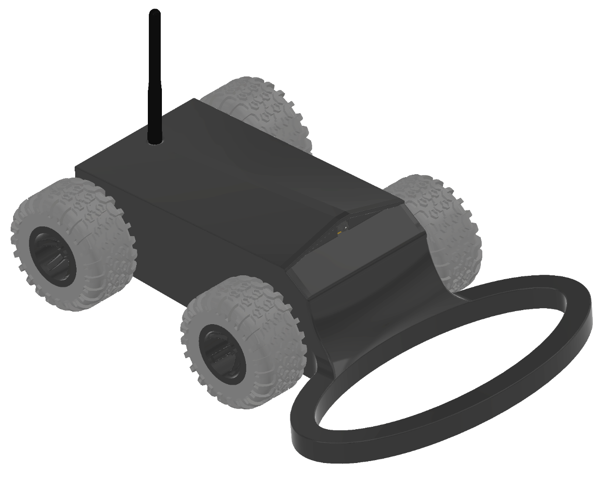
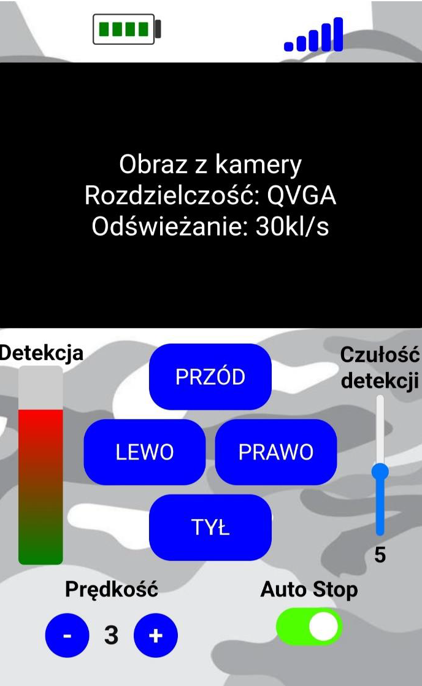
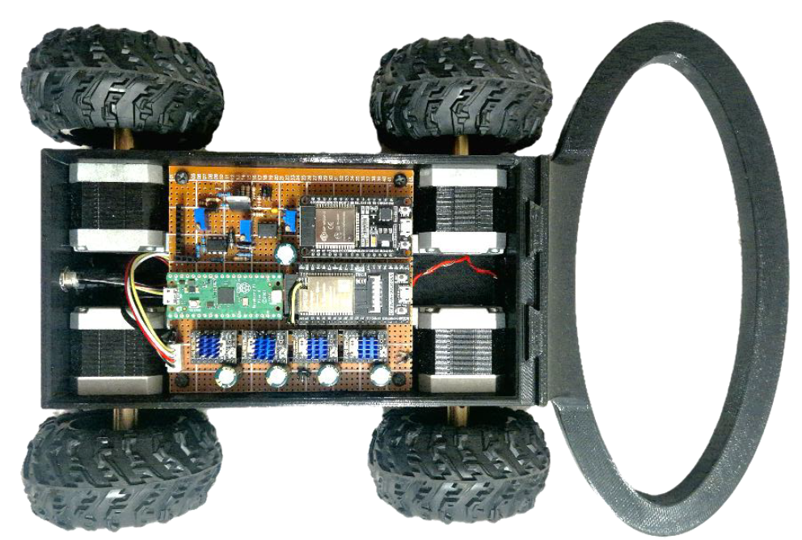

# Military Mobile Robot for Mine Detection

Mobile robot prototype built for my engineering thesis. The project combines a 3D-printed chassis, camera-based remote control, stepper motor drive and a pulse-induction metal detector. The robot was made as a functional model for checking the mechanical layout, wireless control and detector concept.

  

## Project goal

The goal was to design and build a remotely operated mobile platform that can detect metal objects comparable to components of anti-personnel mines. The project covered the mechanical design, electronics, motor control, detector circuit, web interface and selected measurements of the detector response.

This repository is a readable portfolio version of the thesis project. It contains selected firmware, exported figures and lightweight mechanical files. Full Inventor folders, early test sketches, thesis drafts and large reference PDFs are not included.

## How the robot works

The operator connects to the ESP32 WROVER web panel over Wi-Fi. The panel shows a camera preview and provides buttons for driving direction, speed profile, detector sensitivity and automatic stop. Commands from the panel are handled by the WROVER module and sent over UART to the motor controller.

The motor controller is based on an ESP32 WROOM module. It receives simple commands, selects the speed/current profile and drives the stepper motors through TMC2209 drivers. The detector module samples the analog response of the pulse-induction circuit. When the detector reports a valid object, the robot can stop automatically instead of continuing over the detected area.

## System overview

  

| Area | Implementation |
| --- | --- |
| Operator interface | ESP32 WROVER web server with camera preview and control buttons |
| Motor controller | ESP32 WROOM, UART command interface and TMC2209 stepper drivers |
| Detection module | Pulse-induction detector, analog signal conditioning and RP2040 ADC/DMA sampling |
| Motion system | Four stepper motors with configurable speed/current profiles |
| Mechanical design | 3D-printed platform, coil holder and top cover with camera/antenna mounting |
| Power supply | 2S battery pack with charging module and voltage converters |

## Why this architecture

The web interface and camera stream were placed on the ESP32 WROVER because that module has PSRAM and camera support. The stepper control was moved to a separate ESP32 WROOM module, so motor commands and driver configuration could be handled independently from the camera stream. The detector circuit remained a separate measurement block because it required pulse generation, analog signal conditioning and sampling close to the coil. The detector firmware is kept as a PlatformIO/Pico SDK project based on the RP2040 ADC/DMA capture code.

## Web interface

  

The browser panel was used as the operator interface during tests. It includes the camera preview, movement buttons, speed selection, detector sensitivity and status indicators for battery and connection quality. This made the prototype easy to test without a separate desktop application.

## Metal detector

The detector is based on a pulse-induction concept. The coil is excited with a short pulse, and the decay response is sampled after the pulse. A metal object changes the measured response, so the firmware compares averaged samples with a selected threshold.

  

During testing, the detector response was checked for different object distances and sensitivity settings. The measurements were used to choose thresholds that gave stable detection without triggering on normal signal noise.

| Detector response | Signal distribution |
| --- | --- |
|  |  |

## Mechanical model

The mechanical part was designed as a compact printed structure. The platform holds the electronics and drive components, the front section supports the detector coil, and the top cover provides space for the camera and antenna. STEP exports of the main printed parts are included in the `mechanical` folder.

  

## Code included

| Folder | Main file | Purpose |
| --- | --- | --- |
| `firmware/esp32-wrover-web-control` | `camera_web_control_server.ino` | Camera stream, browser panel, Wi-Fi status and UART command handling |
| `firmware/esp32-wroom-motor-controller` | `stepper_motor_controller.ino` | Stepper motor control and TMC2209 configuration |
| `firmware/pulse-induction-metal-detector` | `src/dma_capture.c` | PlatformIO/Pico SDK detector firmware with ADC/DMA sampling and UART output |
| `firmware/sampling-test` | `adc_sampling_test.ino` | Helper sketch used during signal sampling tests |

## Notes

The firmware is kept close to the thesis version. Wi-Fi credentials were removed and replaced with placeholders. The robot is not a production-ready demining device. It is a student prototype used to verify the control concept, mechanical design and metal detection approach.
